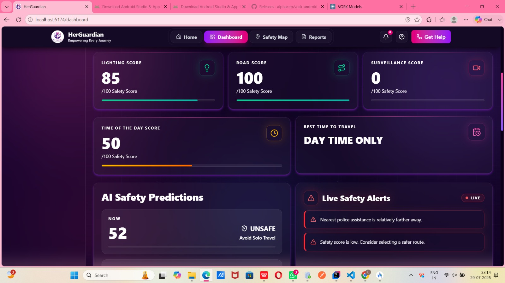
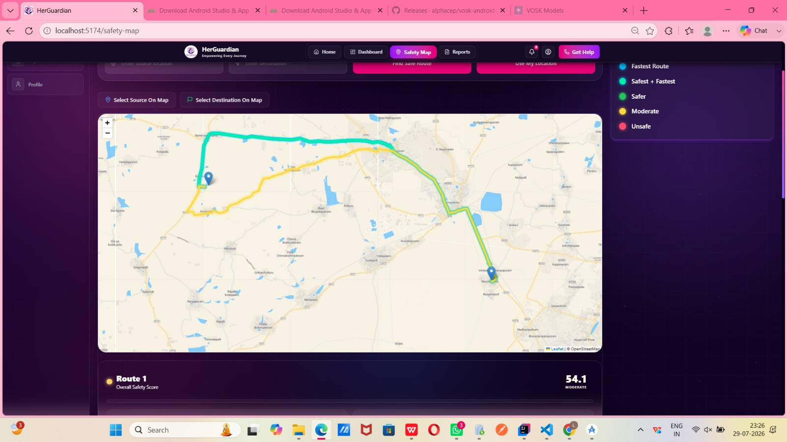
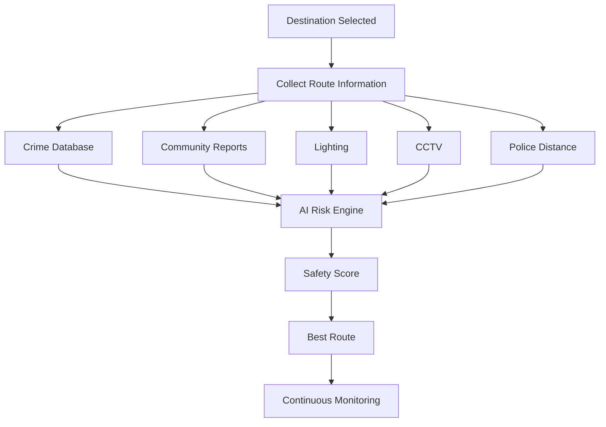
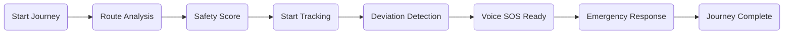

<div align="center">

# 🛡️ HerGuardian

### *Empowering Every Journey with AI-Powered Women's Safety*

> **HerGuardian** is an AI-powered women's safety and intelligent navigation platform that predicts safer travel routes using real-time AI risk analysis, community intelligence, dynamic safety scoring, and hands-free Voice SOS—helping women travel confidently before danger happens, not after.

<br>

[]()
[]()
[]()
[]()
[]()

<br>

## 🚀 AI • Safe Routes • Voice SOS • Community Intelligence • Authority Portal

### **Making Every Journey Smarter, Safer and Fearless.**

</div>

---

# 🌍 Why HerGuardian?

Every day, millions of women make an invisible calculation before stepping outside:

> **"Is this route safe?"**

Traditional navigation systems answer only one question—

> **"Which route is the fastest?"**

They completely ignore:

- Crime history
- Poorly lit roads
- Unsafe neighbourhoods
- CCTV availability
- Police accessibility
- Community reported incidents
- Time-based risk

As a result, women often avoid opportunities because safety cannot be guaranteed.

HerGuardian changes this.

Instead of finding the **fastest path**, it finds the **smartest and safest path**.

Using AI, geospatial intelligence, community reports and live monitoring, HerGuardian predicts danger before users reach it.

---

# 📌 Problem Statement

## Current navigation apps optimize distance.

## Women need navigation that optimizes safety.

---

## 🚨 Real World Challenges

<table>
<tr>
<td width="33%">

### 🚧 Unsafe Navigation

Current map applications recommend routes only by

- Distance
- Traffic
- ETA

without understanding personal safety.

</td>

<td width="33%">

### 🚨 Emergency Delay

Most SOS systems require

- Unlocking phone
- Opening app
- Pressing button

Those few seconds may determine the outcome of an emergency.

</td>

<td width="33%">

### 📊 No Safety Intelligence

Existing systems never learn from

- public incidents
- unsafe locations
- recurring crimes

which means the same dangerous routes continue being suggested.

</td>

</tr>
</table>

---

# 📈 Why This Matters

| Statistic | Impact |
|------------|---------|
| 🚶 86% | Women feel unsafe travelling after dark |
| 🌃 62% | Avoid travelling at night |
| 💼 45% | Miss career or educational opportunities |
| 📱 7 Seconds | Average time required to unlock phone during emergency |
| ❌ 0 | Navigation systems using AI safety prediction |

---

# 💡 Our Solution

HerGuardian combines

- Artificial Intelligence
- Live Route Analysis
- Geospatial Mapping
- Community Intelligence
- Smart Navigation
- Emergency Response

into one intelligent safety ecosystem.

Instead of reacting **after danger occurs**, HerGuardian predicts dangerous situations before users reach them.

---

# 🧠 How HerGuardian Thinks

```
Destination Selected
          │
          ▼

Collect Route Information

          │

 ┌───────────────────────────┐
 │ Crime History             │
 │ Community Reports         │
 │ Time of Day               │
 │ Lighting                  │
 │ CCTV Density              │
 │ Police Stations           │
 │ Road Conditions           │
 └───────────────────────────┘

          │

          ▼

AI Safety Risk Analysis

          │

          ▼

Dynamic Safety Score

          │

          ▼

Safest Route Recommended

          │

          ▼

Continuous Live Monitoring

          │

          ▼

Voice SOS Ready
```

---

# 🎯 Vision

> Technology should never simply guide people to a destination.

It should ensure they arrive there safely.

HerGuardian aims to become India's intelligent safety infrastructure for women by combining AI, smart mapping and community-powered safety intelligence.

---

# ⭐ Project Highlights

## 🧠 AI Powered

Predictive safety scoring instead of reactive alerts.

---

## 🗺 Intelligent Navigation

Routes optimized using

- Safety
- Speed
- Crime trends
- Lighting
- Community intelligence

---

## 🎤 Secret Voice SOS

Hands-free emergency activation.

Even when

✅ Phone locked

✅ Screen off

✅ User cannot touch device

---

## 📍 Live Journey Tracking

Journey remains monitored throughout travel.

Any unexpected deviation immediately increases alert level.

---

## 👥 Community Intelligence

Citizens contribute

- unsafe zones
- suspicious activities
- incidents

AI validates reports and continuously updates safety scores.

---

## 🏛 Authority Portal

Verified authorities receive

- reports
- complaints
- incident locations

allowing faster resolution and transparent tracking.

---

# 🌟 What Makes HerGuardian Different?

| Feature | Traditional Maps | Emergency Apps | HerGuardian |
|----------|-----------------|---------------|-------------|
| Fastest Route | ✅ | ❌ | ✅ |
| Safest Route | ❌ | ❌ | ✅ |
| AI Risk Prediction | ❌ | ❌ | ✅ |
| Dynamic Safety Score | ❌ | ❌ | ✅ |
| Community Intelligence | ❌ | Limited | ✅ |
| Voice SOS | ❌ | Limited | ✅ |
| Live Journey Monitoring | ❌ | ❌ | ✅ |
| Authority Dashboard | ❌ | ❌ | ✅ |
| AI Route Recommendation | ❌ | ❌ | ✅ |

---

# 🔥 Core Features

---

# 🗺 AI Safe Route Navigation

Unlike traditional navigation systems,

HerGuardian analyses

- crime hotspots
- CCTV density
- road lighting
- police proximity
- historical incidents
- travel time
- community reports

before suggesting routes.

Every available route receives a live safety score.

---

# 📊 Dynamic Safety Score

Each road segment receives an AI-generated score between

```
0 ------------- 100

Unsafe        Highly Safe
```

The score continuously updates using

- latest reports
- live incidents
- AI prediction
- environmental context

---

# 🎤 Secret Voice SOS

One predefined emergency phrase instantly

- activates SOS
- shares live location
- alerts emergency contacts
- starts emergency workflow

without touching the phone.

Even works when

- screen is off
- phone locked

---

# 🚨 Smart Emergency Response

Emergency mode immediately

- sends location
- shares safest escape route
- alerts trusted contacts
- enables authority notification

---

# 🛡 AI Safety Maps

Routes are displayed using

🟢 Safe

🟡 Moderate

🔴 High Risk

Users can compare every available route before travelling.

---

# 📡 Live Journey Monitoring

During travel

HerGuardian continuously checks

- route deviation
- new incidents
- emergency triggers

Safety score updates automatically throughout the journey.

---

# 👥 Community Incident Reports

Users help improve safety by reporting

- harassment
- unsafe streets
- poor lighting
- suspicious activities
- accidents

Reports become AI training data after verification.

---

# 🏛 Authority Portal

Government and verified authorities can

- review reports
- verify incidents
- resolve complaints
- update safety information

creating a closed safety ecosystem.

---

# 🔒 Privacy First

User privacy is built into the platform.

✔ Encrypted authentication

✔ JWT security

✔ Password hashing

✔ Secure APIs

✔ Hidden emergency contacts

✔ Protected voice phrase

---

# 📚 Project Resources

| Resource | Link |
|----------|------|
| 🌐 Live Demo | *(Add your deployment link)* |
| 📑 Pitch Deck | *(Google Drive Link)* |
| 📄 Project Report | *(Google Drive Link)* |
| 🎥 Demo Video | *(YouTube Link)* |
| 💻 GitHub Repository | *(Repository Link)* |

---

# 🏆 Hackathon

Built during

## BUILD FOR GOOD • NATIONAL HACKATHON • AWAAZ 05

### Team Vigil

> Building technology that protects before danger happens.

---

# 📸 Screenshots

> *(Screenshots will be added in Part 3)*

- Home Dashboard
- AI Route Map
- Community Reports
- Authority Portal
- Voice SOS
- Safety Dashboard

---
---

# 🏗️ System Architecture

HerGuardian follows a **hybrid Web + Android architecture** powered by AI-driven safety analysis, secure backend services, geospatial intelligence, and real-time community data.

```

```text
                                           🌍 HERGUARDIAN SYSTEM

 ┌────────────────────────────────────────────────────────────────────────────────────────────────────────┐
 │                                         USER DEVICES                                                   │
 └────────────────────────────────────────────────────────────────────────────────────────────────────────┘

          🌐 Web Application                                      📱 Android Application
        (Dashboard & Navigation)                              (Secret Voice SOS Module)

                 │                                                         │
                 └──────────────────────┬──────────────────────────────────┘
                                        │
                                        ▼

                          🔐 JWT Authentication & Authorization

                                        │
                                        ▼

                      ┌────────────────────────────────────┐
                      │      Spring Boot REST API          │
                      │------------------------------------│
                      │ User Management                    │
                      │ Route Management                   │
                      │ Incident Reporting                 │
                      │ Authority Portal                   │
                      │ Safety Dashboard                   │
                      │ Authentication                     │
                      └────────────────────────────────────┘

                                        │
          ┌─────────────────────────────┼──────────────────────────────┐
          ▼                             ▼                              ▼

 ┌───────────────────┐       ┌──────────────────────┐      ┌────────────────────┐
 │ AI Risk Engine    │       │ PostgreSQL Database  │      │ External APIs      │
 ├───────────────────┤       ├──────────────────────┤      ├────────────────────┤
 │ Safety Prediction │       │ Users               │      │ Geoapify API       │
 │ Route Analysis    │       │ Routes              │      │ MapTiler API       │
 │ AI Scoring        │       │ Incidents           │      │ Browser GPS        │
 │ Pattern Learning  │       │ Reports             │      │ OpenRouteService   │
 └───────────────────┘       │ Safety Scores       │      └────────────────────┘
                              └──────────────────────┘

                                        │

                                        ▼

                    🛡 Safe Route Recommendation + Live Monitoring
```

---

# ⚡ Complete Data Flow

```text
User
 │
 ▼
React Frontend
 │
 ▼
JWT Authentication
 │
 ▼
Spring Boot Backend
 │
 ├────────────► PostgreSQL
 │
 ├────────────► AI Risk Analysis Engine
 │
 ├────────────► Geoapify
 │
 ├────────────► MapTiler
 │
 ├────────────► Browser Geolocation
 │
 ▼
Dynamic Safety Score
 │
 ▼
Safe Route Recommendation
 │
 ▼
Continuous Journey Monitoring
 │
 ▼
Voice SOS + Authority Notification
```

---

# 🧠 AI Risk Analysis Engine

Unlike conventional navigation systems, HerGuardian continuously evaluates multiple safety indicators before recommending a route.

---

## AI evaluates

✅ Crime history

✅ Time of travel

✅ Street lighting

✅ CCTV availability

✅ Community reports

✅ Police station proximity

✅ Road category

✅ Historical incidents

✅ Unsafe zone frequency

---

## AI Processing Pipeline

```text
Historical Crime Data
           │
Community Reports
           │
Lighting Information
           │
Police Distance
           │
Road Metadata
           │
Time Of Day
           │
───────────────
Feature Engineering
───────────────
           │
Safety Prediction Model
           │
Dynamic Risk Calculation
           │
Safety Score (0-100)
           │
Best Route Recommendation
```

---

# 📊 Dynamic Safety Score Engine

Every road segment receives a dynamic AI score.

```
0 ───────────────────────────────► 100

Very Unsafe                Highly Safe
```

The score updates continuously whenever

- new incidents are reported
- authorities verify reports
- travel conditions change
- AI detects new risks

---

# 🎤 Secret Voice SOS Architecture

The Android companion application continuously waits for a predefined secret phrase.

```
User Speaks Secret Phrase

            │

            ▼

Speech Recognition

            │

            ▼

Voice Verification

            │

            ▼

Emergency Trigger

            │

 ┌──────────┼──────────────┐

 ▼          ▼              ▼

Share GPS  Notify Contacts Notify Authority

            │

            ▼

Emergency Mode Activated
```

Unlike traditional SOS applications,

✔ no unlock

✔ no app opening

✔ no button press

---

# 📡 Live Journey Monitoring

During travel HerGuardian performs continuous monitoring.

```
Journey Started

       │

       ▼

Current GPS

       │

       ▼

Compare Planned Route

       │

 ┌─────┴────────────┐

 ▼                  ▼

Safe            Route Deviation

                    │

                    ▼

Risk Increased

                    │

                    ▼

Alert User

                    │

                    ▼

Offer Safer Route
```

---

# 👥 Community Intelligence

Every verified report strengthens future AI predictions.

```
Citizen Report

      │

      ▼

Verification

      │

      ▼

Authority Review

      │

      ▼

Database Update

      │

      ▼

AI Retraining

      │

      ▼

Future Safety Prediction
```

This creates a continuously improving safety ecosystem.

---

# 🏛 Authority Portal

Authorities receive a dedicated dashboard to

- Verify incidents
- Resolve complaints
- Monitor reports
- Update danger zones
- Track community issues
- Improve city safety

Unlike existing systems,

citizens and authorities collaborate through one platform.

---

# 📂 Folder Structure

```text
HerGuardian

│

├── frontend
│   ├── src
│   ├── assets
│   ├── pages
│   ├── components
│   ├── hooks
│   ├── services
│   ├── utils
│   └── styles
│
├── backend
│   ├── controller
│   ├── service
│   ├── repository
│   ├── entity
│   ├── dto
│   ├── security
│   ├── config
│   └── exception
│
├── android
│   ├── activities
│   ├── services
│   ├── voice
│   ├── models
│   └── utils
│
├── ai-engine
│   ├── prediction
│   ├── scoring
│   ├── preprocessing
│   └── models
│
└── database
    ├── schema.sql
    └── seed.sql
```

---

# 🛠 Complete Tech Stack

| Layer | Technologies |
|--------|--------------|
| Frontend | React.js, Vite, Tailwind CSS v4, Axios, React Router DOM, React Leaflet, Lucide React |
| Backend | Java, Spring Boot, Spring MVC, Spring Security, JWT, Hibernate, Spring Data JPA, Maven |
| Database | PostgreSQL, PostgreSQL JDBC, Hibernate ORM |
| AI Engine | AI Risk Analysis, Safety Prediction Models |
| Android | Java, Android SDK, XML, Gradle, Google Maps SDK, Retrofit |
| Maps | Geoapify API, MapTiler API, OpenRouteService, Browser Geolocation |
| Authentication | JWT Authentication, BCrypt Password Encryption |
| Deployment | Vercel, Railway |
| DevOps | Git, GitHub, Maven, Postman, VS Code, IntelliJ IDEA |

---

# 🔐 Security Architecture

Security is integrated across every layer.

## Authentication

- JWT Tokens
- Secure Login
- Session Validation

---

## Authorization

Role-Based Access Control (RBAC)

```
Guest

 │

 ▼

Registered User

 │

 ▼

Authority

 │

 ▼

Administrator
```

Each role receives only the permissions required.

---

## Password Protection

Passwords are

- BCrypt Hashed
- Never stored in plain text
- Protected during transmission

---

## API Security

Every API request passes through

```
Request

 │

 ▼

JWT Validation

 │

 ▼

Role Verification

 │

 ▼

Input Validation

 │

 ▼

Business Logic

 │

 ▼

Database
```

---

# 🗄 Database Design

### Core Entities

```
User

 │

 ├── Saved Routes

 ├── Emergency Contacts

 ├── Voice Phrase

 ├── Reports

 ├── Journey History

 └── Profile
```

---

### Incident Entity

```
Incident

 │

 ├── Location

 ├── Category

 ├── Description

 ├── Image

 ├── Status

 ├── Timestamp

 └── Verified By Authority
```

---

### Safety Score Entity

```
Route

 │

 ├── Lighting Score

 ├── Crime Score

 ├── CCTV Score

 ├── Police Distance

 ├── Community Rating

 └── Final AI Score
```

---

# 🚀 Performance Highlights

✔ Fast React frontend

✔ Optimized Spring Boot backend

✔ Efficient PostgreSQL queries

✔ AI-assisted route calculations

✔ Secure JWT authentication

✔ Scalable REST APIs

✔ Modular architecture

✔ Mobile-ready design

---

# 💎 Design Philosophy

HerGuardian is designed around one principle:

> **Safety should be proactive, intelligent, and accessible.**

Every feature—from AI-powered route analysis to hands-free Voice SOS—works together to reduce risk before an emergency occurs.

---

# 📸 Project Showcase

## 🏠 Smart Safety Dashboard

> A centralized dashboard that provides an overview of safety analytics, active incidents, AI safety score, live journey status, and community activity.

<p align="center">

</p>

---

## 🗺 AI Safety Route Navigation

Instead of displaying only the fastest route, HerGuardian visualizes **every available path** with AI-generated safety scores.

### Route Colors

🟢 Safe Route

🟡 Moderate Risk

🔴 High Risk

Users can choose between:

- Fastest Route
- Safest Route
- Balanced Route

<p align="center">

</p>

---

## 🎤 Secret Voice SOS

One of HerGuardian's signature innovations.

Instead of unlocking the phone,

the user simply says their predefined emergency phrase.

Example:

```
"Guardian Protect Me"
```

Immediately the application

✅ Detects Voice

✅ Verifies Phrase

✅ Shares Live Location

✅ Alerts Emergency Contacts

✅ Activates Emergency Mode

Works even when:

- Screen Off
- Phone Locked
- Hands Busy

<p align="center">

</p>

---

## 📊 AI Dynamic Safety Dashboard

The dashboard continuously updates

- Current Safety Score
- Live Incidents
- Nearby Police Stations
- Community Alerts
- Route Health
- Active Journey

Everything updates dynamically.

---

## 🏛 Authority Portal

Authorities receive an exclusive dashboard to

- Verify incidents
- Resolve reports
- Update unsafe zones
- Manage complaints
- Track city safety

This closes the gap between

Community → Authorities → Citizens.

---

## 👥 Community Intelligence

Every verified report becomes part of the AI learning system.

```
Citizen

   │

   ▼

Incident Report

   │

   ▼

Verification

   │

   ▼

Authority Approval

   │

   ▼

Database Update

   │

   ▼

AI Learns

   │

   ▼

Future Users Stay Safer
```

---

# 🌍 Real World Impact

## Women deserve freedom, not fear.

HerGuardian aims to transform urban mobility by combining

- Artificial Intelligence
- Smart Navigation
- Community Collaboration
- Government Participation

into one intelligent ecosystem.

---

## Potential Impact

### 👩 600+ Million Women

Potential beneficiaries across India.

---

### 🚨 Faster Emergency Response

Secret Voice SOS removes

- unlock delay
- application opening
- manual interaction

---

### 📊 Smarter Cities

Authorities receive

- verified reports
- safety analytics
- incident hotspots

to improve infrastructure.

---

### 🤖 AI That Improves Daily

Unlike static navigation,

HerGuardian becomes smarter every day through

- AI learning
- verified reports
- route history
- community intelligence

---

# 📈 Why HerGuardian is Different?

| Feature | Google Maps | bSafe | Life360 | Government Apps | 🛡 HerGuardian |
|----------|-------------|--------|----------|-----------------|----------------|
| Fastest Route | ✅ | ❌ | ❌ | ❌ | ✅ |
| AI Safe Route | ❌ | ❌ | ❌ | ❌ | ✅ |
| Crime Analysis | ❌ | ❌ | ❌ | Limited | ✅ |
| Dynamic Safety Score | ❌ | ❌ | ❌ | ❌ | ✅ |
| Secret Voice SOS | ❌ | Limited | ❌ | ❌ | ✅ |
| Live Journey Tracking | Limited | ✅ | ✅ | ❌ | ✅ |
| Community Intelligence | ❌ | Limited | ❌ | Limited | ✅ |
| Authority Dashboard | ❌ | ❌ | ❌ | Limited | ✅ |
| Predictive AI | ❌ | ❌ | ❌ | ❌ | ✅ |

---

# 🚀 Roadmap

## ✅ Current Version

- AI Safety Navigation
- Dynamic Safety Score
- Voice SOS
- Authority Portal
- Community Reports
- Live Dashboard
- Safe Route Recommendation

---

## 🔜 Phase 2

- Smartwatch Integration
- Wearable SOS
- Family Tracking
- Push Notifications
- Offline Emergency Mode

---

## 🔜 Phase 3

- City-wide Safety Dashboard
- Municipal Integration
- Police API Integration
- CCTV Intelligence
- Public Transport Safety

---

## 🔜 Future Vision

- Pan India Deployment
- AI Predictive Crime Zones
- Drone Emergency Assistance
- Smart Traffic Integration
- Smart City Collaboration

---

# 📦 Installation

## Clone Repository

```bash
git clone https://github.com/YOUR_USERNAME/HerGuardian.git
```

```bash
cd HerGuardian
```

---

## Frontend

```bash
cd frontend

npm install

npm run dev
```

---

## Backend

```bash
cd backend

mvn spring-boot:run
```

---

## Android

```bash
cd android
```

Open Android Studio

Run application.

---

# 🔐 Environment Variables

Create a `.env`

```env
MAPTILER_API_KEY=

GEOAPIFY_API_KEY=

JWT_SECRET=

DB_URL=

DB_USERNAME=

DB_PASSWORD=
```

---

# 📂 Project Structure

```
HerGuardian

├── frontend
├── backend
├── android
├── database
├── docs
├── screenshots
├── assets
└── README.md
```

---

# 🤝 Contributing

Contributions are always welcome.

### Steps

1. Fork Repository

2. Create Branch

```
git checkout -b feature-name
```

3. Commit

```
git commit -m "Added feature"
```

4. Push

```
git push origin feature-name
```

5. Open Pull Request

---

# 👥 Team Vigil

<table>
<tr>

<td align="center">

## 👩‍💻 Leela Satya Vijayeswari Kopalli

**Team Lead**

AI Safety Scoring

Frontend

UI/UX

Product Design

</td>

<td align="center">

## 👨‍💻 Ajnabh Koushik Baruah

**Developer**

Spring Boot Backend

Authority Portal

Android Integration

Database

Security

</td>

</tr>
</table>

---

# 🏆 Hackathon

Built with ❤️ for

# BUILD FOR GOOD

## NATIONAL HACKATHON

### AWAAZ 05

---

# 📄 License

Distributed under the MIT License.

See **LICENSE** for more information.

---

# 🙏 Acknowledgements

Special thanks to

- React.js
- Spring Boot
- PostgreSQL
- Geoapify
- MapTiler
- OpenRouteService
- Android Studio
- Maven
- GitHub
- Vercel
- Railway

for enabling the technologies behind HerGuardian.

---

# ❤️ Our Vision

> **"Technology should not only guide people to destinations—it should help them arrive safely."**

HerGuardian is more than a navigation platform.

It is a mission to ensure that **every woman can travel confidently, independently, and without fear**, powered by intelligent technology, proactive protection, and community-driven safety.

---
<!-- ========================================================= -->
<!--                 PREMIUM README ADDITIONS                  -->
<!-- ========================================================= -->

<div align="center">

# 🚀 Explore HerGuardian

<p>

<a href="#-problem-statement">Problem</a> •
<a href="#-our-solution">Solution</a> •
<a href="#-features">Features</a> •
<a href="#-system-architecture">Architecture</a> •
<a href="#-tech-stack">Tech Stack</a> •
<a href="#-screenshots">Screenshots</a> •
<a href="#-roadmap">Roadmap</a> •
<a href="#-installation">Installation</a>

</p>

</div>

---

# 🌟 Project Highlights

<div align="center">

| 🧠 AI Powered | 🗺 Smart Navigation | 🎤 Voice SOS |
|:------------:|:------------------:|:------------:|
| Predictive Route Intelligence | Safety-aware Route Planning | Hands-free Emergency Trigger |

| 📡 Live Monitoring | 👥 Community Reports | 🏛 Authority Portal |
|:----------------:|:-------------------:|:-----------------:|
| Real-Time Journey Tracking | Verified Incident Intelligence | Report Resolution Dashboard |

</div>

---

# 📊 At a Glance

| Feature | Value |
|---------|-------|
| 👩 Target Users | Women & Families |
| 🛣 Route Planning | AI Safety Based |
| 📍 Maps | Geoapify + MapTiler |
| 🤖 AI | Dynamic Risk Prediction |
| 🔐 Authentication | JWT |
| 🗄 Database | PostgreSQL |
| 🌐 Platform | Web + Android |
| 🚨 Emergency | Secret Voice SOS |
| 🏛 Government | Authority Portal |
| 📡 Monitoring | Live Journey Tracking |

---

# 🎯 Core Innovations

Unlike traditional navigation systems, HerGuardian introduces multiple innovations into a single platform.

---

## 🧠 AI Safety Intelligence

Rather than selecting the shortest path,

HerGuardian evaluates

✔ Crime Rate

✔ CCTV Density

✔ Lighting Conditions

✔ Police Availability

✔ Community Reports

✔ Time of Day

✔ Historical Incidents

before generating a route recommendation.

---

## 🎙 Secret Voice SOS

Traditional SOS systems require

❌ Unlock Phone

❌ Open App

❌ Press Button

HerGuardian requires only

```
Speak Secret Phrase
```

Everything else happens automatically.

---

## 📍 Dynamic Route Prediction

Every few seconds

```
Current Position

↓

AI Recalculates Risk

↓

Safety Score Updates

↓

Route Recommendation Updates
```

The user always has the safest available path.

---

# 📈 Safety Score Formula

```
Safety Score

=

Crime Risk

+

Lighting

+

Police Distance

+

Community Rating

+

CCTV Coverage

+

Time Based Safety

↓

AI Prediction

↓

Final Score (0-100)
```

---

# 📊 AI Decision Pipeline



---

# 🛰 Journey Lifecycle



---

# 🧩 Platform Modules

```
HerGuardian

│

├── Authentication

├── AI Engine

├── Safe Navigation

├── Voice SOS

├── Community Reports

├── Authority Portal

├── Safety Dashboard

├── Emergency Contacts

├── Live Journey

└── Analytics
```

---

# 📡 REST API Overview

| Endpoint | Method | Description |
|-----------|---------|-------------|
| /api/auth/register | POST | Register User |
| /api/auth/login | POST | Login |
| /api/routes | GET | Get Safe Routes |
| /api/reports | POST | Submit Incident |
| /api/reports | GET | Fetch Reports |
| /api/dashboard | GET | Dashboard Data |
| /api/profile | GET | User Profile |
| /api/sos | POST | Trigger SOS |

---

# 💾 Database Overview

| Table | Purpose |
|---------|----------|
| Users | Registered Users |
| Routes | Navigation History |
| Reports | Community Incidents |
| EmergencyContacts | Trusted Contacts |
| JourneyHistory | Previous Trips |
| Authorities | Verified Authorities |
| SafetyScores | AI Generated Scores |

---

# 📱 Supported Platforms

| Platform | Status |
|----------|--------|
| Desktop | ✅ |
| Mobile Browser | ✅ |
| Android | ✅ |
| Tablet | ✅ |

---

# 🎨 UI Design Principles

HerGuardian follows a modern design philosophy.

✅ Dark Theme

✅ Accessibility

✅ High Contrast

✅ Responsive Layout

✅ Mobile First

✅ Fast Navigation

✅ Minimal Learning Curve

---

# 📌 Future AI Research

Future versions aim to include

- Crowd Density Prediction

- AI Crime Forecasting

- Smart CCTV Integration

- Weather-aware Safety Analysis

- Drone Emergency Support

- Smartwatch SOS

- Offline AI Navigation

- Transport Safety API

- AI Behaviour Prediction

- Smart City Integration

---

# ❓ Frequently Asked Questions

### Why is HerGuardian different?

Unlike ordinary navigation apps,

HerGuardian predicts unsafe situations before users reach them.

---

### Does Voice SOS work when the phone is locked?

Yes.

The Android application listens securely for the predefined emergency phrase and activates the emergency workflow.

---

### Does AI continuously update routes?

Yes.

The AI recalculates safety throughout the journey.

---

### Can authorities verify incidents?

Yes.

The Authority Portal enables verification, tracking and resolution.

---

### Can community reports improve AI?

Yes.

Verified reports continuously improve future route recommendations.

---

# 🏅 Awards & Recognition

🏆 Build for Good

🏆 National Hackathon

🏆 AWAAZ 05

---

# 🌎 Vision 2030

Our long-term vision is to create

> India's largest AI-powered public safety navigation ecosystem.

Future deployments include

🏙 Smart Cities

🚇 Public Transport

🚔 Police Systems

🎓 University Campuses

🏢 Corporate Safety Networks

---

# 💖 Support

If you found HerGuardian useful

⭐ Star this repository

🍴 Fork the project

📢 Share it

🤝 Contribute

---

<div align="center">

# 🌟 Thank You

### Together, let's make every journey safer.

---

### 🛡 HerGuardian

**Empowering Every Journey**

Made with ❤️ by **Team Vigil**

⭐ **Star the repository if you believe technology can make the world safer.**

</div>
